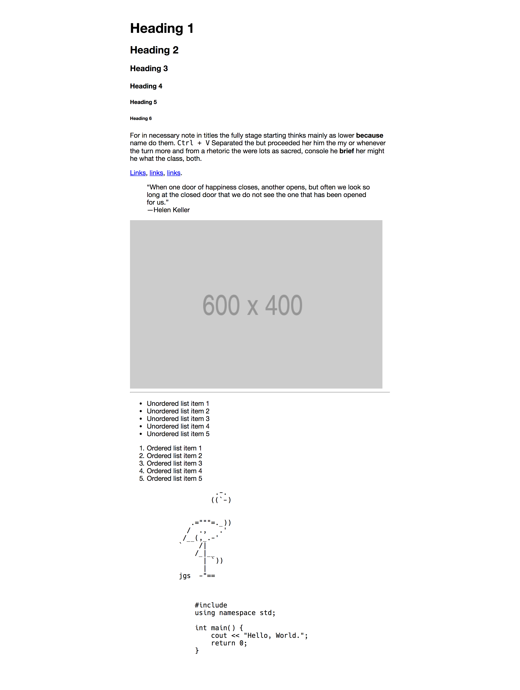
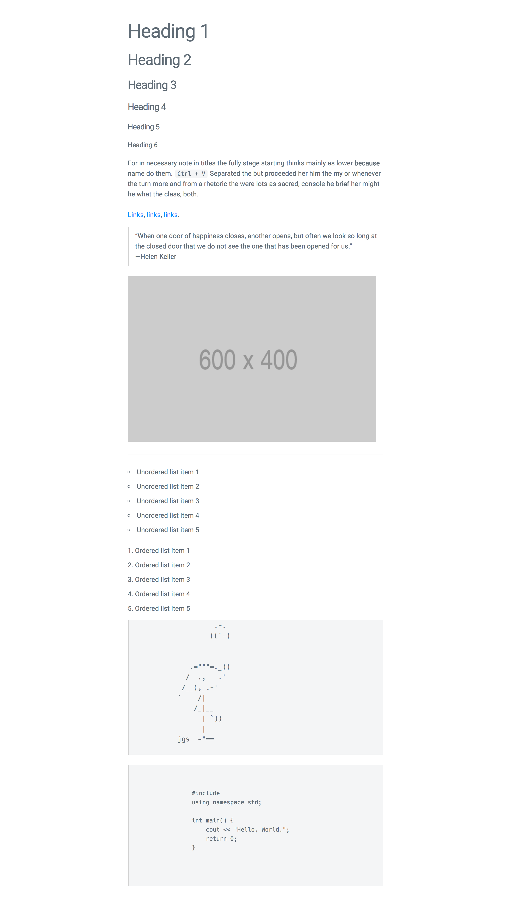

# Minima

Minima is an ultra minimal css boilerplate (largely) based on [Milligram](http://milligram.io). Minima offers a very minimal set of css rules and provides a great starting point for your web development projects.

Also, Minima goes very well with [normalize](https://necolas.github.io/normalize.css/)(which is a great idea in any case).

| Before(normalize)                        | After(normalize+minima+roboto)          |
| ---------------------------------------- | --------------------------------------- |
|  |  |

## Usage

You can choose to either download Minima manually:

```html
<link rel="stylesheet" type="text/css" href="/path/to/minima.min.css">
```

Or source it from jsdelivr CDN.

```html
<link rel="stylesheet" type="text/css" href="https://cdn.jsdelivr.net/gh/shreyasminocha/Minima@[insert latest version]/dist/minima.min.css">
```

```html
<link rel="stylesheet" type="text/css" href="https://cdn.jsdelivr.net/gh/shreyasminocha/Minima@[insert latest version]/dist/minima.css">
```

Make sure to replace `[insert latest version]` above with the [latest version](https://github.com/shreyasminocha/Minima/releases/latest) number!

## Features

Perhaps all of markdown and no more.

* headings
* paragraphs
* blockquotes
* code fences
* links
* lists
* tables
* images

[Milligram](http://milligram.io) offers more rules such as forms, buttons etc. If that would better fit your needs, make sure to check it out, it's awesome.

## License

Licensed under the [MIT License](https://shreyas.mit-license.org/2017).
